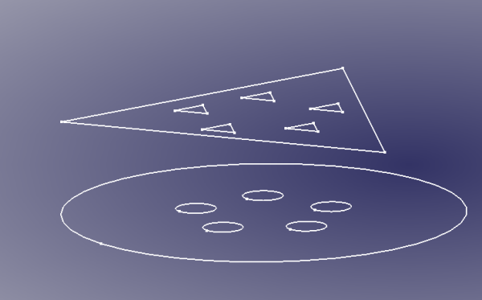
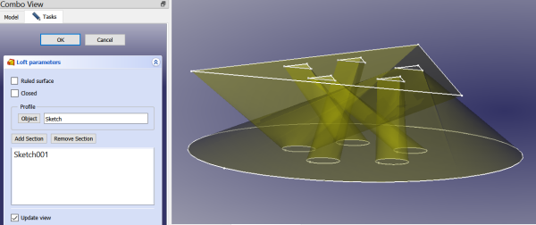
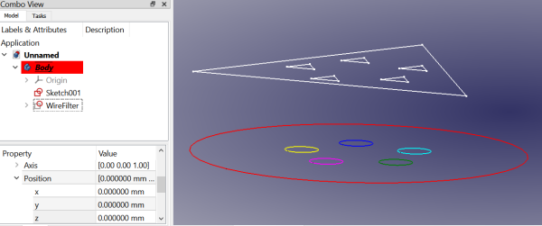
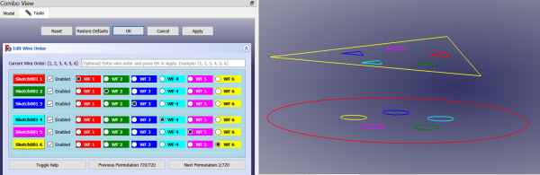
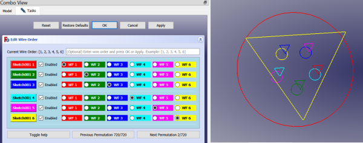
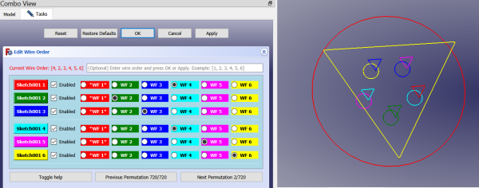
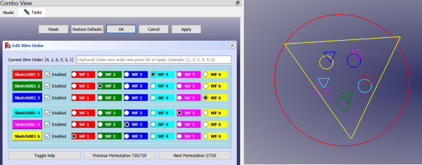
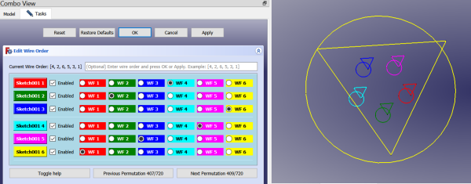
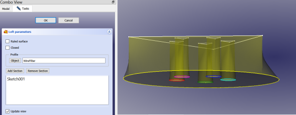

# WireFilter
With this FreeCAD macro you can filter a sketch (or any object with wires, including solids) to use only the wires you desire to use.  The sketch itself is unchanged.  The filter acts as an intermediary.  You can also 2D offset the wires, reorder the wires, scale the wires (independently in x, y, z directions), choose among 4 different face makers, and form a new wire from selected edges.  When used in Part Design it automatically inserts itself into the parent body of the selected sketch.  With WireFilter you can use Pad on sketches it would otherwise not be able to use (if it has nested wires within nested wires, for example if you make a face using the FaceMakerBullseye option). 
 
 
 
<a href="wirefilter_bullseye_example.FCStd">Download</a> the example file. 
 
## Installation
Install using the addon manager.  Tools menu -> addon manager -> macros -> WireFilter
## Toolbar Icon
<a href="wirefilter.svg">Download</a> the toolbar icon: 

## Usage
Select an object to filter.  If the entire object is selected in the tree, then all the wires are used.  If one or more faces are selected, then the wires that make up those faces are used.  If one or more edges are selected, then the wires that contain those edges will be filtered for use.  After making the desired selection run the macro, and a new document object called WireFilter will be created.  Modify the WireFilter by editing its properties.

By default it locates itself coincident with the filtered object, but if you wish to do so you can toggle the Follow Source property to False, and then attach the WireFilter or adjust its placement as desired.  In this manner you can have multiple WireFilters of the same sketch and place them in different positions, for example, to loft between them.

## Wire Reordering
Sometimes it happens we must reorder the wires in a sketch in preparation for using Part Design Loft or Part Design Multi-section Sweep.  In those operations the wires of each section are connected.  For example, in the Loft operation Wire1 of the base sketch is lofted to Wire1 in the section sketch.  Wire2 of the base sketch to Wire2 of the section sketch, and so on.  But which is Wire1 and how does FreeCAD know what the user intends?  The way this works is the first created wire is Wire1, and the 2nd is Wire2, and so on.  So, it depends on the order of creation.  The problem with that is the user might not make all the wires in the same order in both sketches.  In the simple case of a circle within another circle it's a trivial fix as the user can simply swap the radius or diameter constraints, but in more complicated sketches, such as 5 holes inside a circle for a hub, this can be a complicated process.  The user might in the end resort to completely recreating both sketches, taking care to create the wires in the same order.  This is where WireFilter can come in.

Consider these 2 sketches:

And how it looks in the Part Design Loft dialog when we see the preview.  Several of the wires are crossed.

We can solve this with a WireFilter of one of the sketches.  We'll choose Sketch (bottom sketch) in this example.  Select the sketch in the combo view and run the WireFilter macro.

In the above image you can see the WireFilter object is displayed with different colors for each wire in the 3D view.  The sequence is RGBCMY = Red (Wire1), Green (Wire2), Blue (Wire3), Cyan (Wire4), Magenta (Wire5), Yellow (Wire6).

Next, we need to reorder the wires of the WireFilter object so that they will connect to the desired wires in Sketch001.  We don't modify Sketch at all, but rather use the WireFilter object as a filter or interface for that sketch.  Select the WireFilter in the combo view, right click to bring up the context menu, select "Edit Wire Orders" in the menu.  This brings up the Wire Editor dialog, which is a Task panel dialog.

Notice in the above image now we can see the wire colors for both sketches.  What is happening behind the scenes is a new WireFilter object has been created temporarily for this purpose.  The new object ("WF_Ghost") will be deleted automatically when the dialog closes.  It's purpose is to help us see which wires are which when we begin reordering the wires.

Notice in the image there is a grid of buttons.  The left column is full of push buttons, one for each wire in the compare object, which in this case is the sketch we want to use for the section in the Loft.  In this file there was only one other sketch in the model, so the WF_Ghost was made of that other sketch.  Had there been more options the user would have been presented with a list of options to choose from.

In the next column there are a bunch of checkboxes labeled "Enabled", all of them checked.  WireFilter can also disable wires.  This is done by setting the Wire Order for that wire to 0, which is accomplished in the dialog by unchecking the appropriate "Enabled" checkbox.  When you uncheck one of these check boxes the wire to be disabled will flash red to orange to yellow in the 3D view to acknowledge which wire is to be disabled.  If the wrong wire flashes, just check the box and uncheck the correct one.  When the box is checked to re-enable the wire the wire being re-enabled will flash again, this time the colors it flashes through will be blue to green to teal, to serve as the visual confirmation of which wire is getting re-enabled.

The remaining columns are radio buttons.  Each row has one (and only one) radio button selected.  That is the wire to which this wire (based on row number) will connect to in the Loft or Multi-section Sweep.  The top row is for Wire1, which is why the "Sketch001 1" button is Red, and why the next row "Sketch001 2" button is green, and so on.  If you click one of the push buttons the wire associated with that button will flash confirmation.  This selection flash goes through colors white, black, and gray.  We have 3 types of flashes the wires can do: Selection flash (white-gray-black), Disable flash (red-orange-yellow), and Enable flash (green-blue-teal).  If you click one of the radio buttons, whether it's already selected or not, the associated wire in the WireFilter object will flash.  All of these radio buttons are color-coded to match up with the color of the wire it is associated with.  If there are many wires sometimes the colors can appear ambiguous, but this is where the flashing really comes in handy.

In this example, we click the Sketch 1 push button and note which wire flashes in the 3D view. It's the red triangle in the upper object.  We can move the 3D view around to get a better angle, shown in the image below:

We can see that the cyan circle in the bottom image is the proper one to connect to this wire, so we select the cyan-colored radio button in that row.  Notice that the Wire Order label at the top of the dialog is now red in color.  This indicates there are duplicates in the wire order.  If you look at the wire order you see that Wire4 appears twice.  Also note that column of red buttons for WF 1 (WireFilter Wire1) all have asterisks in the labels.  This indicates this column has no radio buttons selected.  We are in a bit of an error state at this point, but this is normal and will always happen during the rewiring process.  They're just indicators that we should not click Apply or OK at this time because we don't have the wire order correct yet.  The wire order label will turn black again once we have each wire in the WireFilter object connected to a unique wire in the compare object (Sketch001) in this example.

Next we go through and click the push button in the next row (green one), see which wire flashes, and select the appropriate radio button to connect to that wire.  In this example, the green triangle is already aligned with the green circle, so we don't need to do anything.  We move to the next row.  Clicking the blue push button shows us the blue triangle needs to connect to the yellow circle, so we select the yellow radio button.  They cyan push button needs to connect to the magenta circle, so we select the magenta radio button (WF 5).  Magenta to blue and yellow to red in the last 2 rows, respectively.  Here is how it looks with all the correct radio buttons selected:

Notice in the above image the Wire Order label is back to black again and none of the columns have asterisks in their labels.  Next, we click OK, and check the new color scheme for the WireFilter object and how that compares to the compare object (WF_Ghost):

Then we click OK to close the dialog.  Next, select the WireFilter object and Sketch001 in the combo view and click the Loft toolbar icon.  This brings us up the new Loft preview:

<a href="WireFilter_Example.FCStd">Example featuring loft</a>

## Properties
A WireFilter object is a feature python object, fully parametric, with properties you may edit to change the object's behavior and in some cases to trigger commands.
### Offsetting
WireFilter's support 2D offsetting.  This is substantially the same tool used for Part workbench 2D offsetting, except we access via python here.  You have many of the same options.
#### Offset (float)
Default: 0.0.  The offset value (in mm).  A negative value will offset inwards.
#### Offset Fill (boolean)
Default: False.  If True, a face is made between the offset and the original wire.
#### Offset Intersection (boolean)
Default: False.  This manages how child shapes are handled, whether collectively (default) or independently.
#### Offset Join (enumeration)
Default: Arcs.  Options: Arcs, Tangent, Intersection.  The join type affects in some cases whether you get fillets or sharp angles where the new edges are joined.
#### Offset Open Result (boolean)
Default: False.  Whether to allow an open wire in the results.  If False open wires are closed.  For example, a straight line will be offset by encircling it with a slot-like wire with arcs at each end.
### Scaling
We can scale independently along all 3 major axes, x, y, and z.  -1 will mirror along that axis.
#### Scale (vector)
Default: (1,1,1).  The scale to use for the x, y, and z directions.  (Code borrowed / liberated / stolen from Draft Clone code.
#### Uniform Scale (float)
Default: 1.0.  Scale equally in all directions.  With 2D wires, Z is ignored during the scaling.  The XYZ scaling above doesn't recenter the object, but this one does, so use it where you want to keep the scaled object centered with the original.
#### Claim Children (boolean)
Default: True.  Whether to claim children in the tree view.  You may toggle this to see the effect.
#### Colorize (boolean)
As of version 0.2021.12.6 individual wires are now color-coded in the 3D view.  Each edge of the wire gets the same color, beginning with red, green, blue, etc. for Wire1, Wire2, Wire3, and so on.  Set Colorize property to False to disable this feature.  Note: in some cases an edge may belong to more than one wire.  In such cases the last wire color to be set will take precedence.  For example, if Edge1 belongs to both Wire1 and Wire2, then Edge1 will be set to green because the edges in Wire2 get set later than the edges in Wire1, and those previously set colors get overwritten.

Default: True.  Set to False to disable the colorize feature.  All wires will be default black color.
#### Face Maker (enumeration)
Default: No Face.  Options: No Face, Part::FaceMakerBullseye, Part::FaceMakerCheese, Part::FaceMakerSimple, Part::FaceMakerExtrusion, InvertedFace.  Each has its strengths and limitations.  Sometimes when one fails another might work.  Bullseye is good at handling holes inside of holes in faces.  None of the others can do this.  Cheese is good as multiple holes, but not nested holes.  Simple and Extrusion fail with holes, but can manage some nonplanar wires where Bullseye and Cheese fail.  InvertedFace is a new custom type that creates a new inverted face.  The outer wire of the original face is scaled to InvertedFaceScale property, a face is made from that scaled outer wire and the original face cut from it to make the inverted face.  The FilledFace type uses Part.makeFilledFace(), which can make nonplanar faces.
#### Fix Normal (boolean trigger)
Triggers a command, sets itself back to False.  The command is to attempt to fix a Pad or Extrude that has failed to determine the correct normal for a WireFilter pad or extrusion.  The WireFilter object computes its own normal.  (See Normal property.)  This Normal is used as a custom direction in the Pad or Extrude object.  If this doesn't work, try making a face and doing it again.
#### Follow Source (boolean)
Default: True.  If True, the WireFilter object's shape is at the same placement as the original object.  If the source object moves, the WireFilter moves with it.  Set this to False if you want to be able to place the WireFilter in another placement.
#### InvertedFaceScale (float)
Default: 5.  Only applicable when Face Maker property is set to InvertedFace.  The original face's outer wire is scaled by this amount and used to create a new face.  From the new face the original face is cut to create the inverted face.
#### Max Wires (integer)
Default: 25.  This is to prevent locking up FreeCAD for a long time if trying to use a complex source with many wires.  Only Max Wires count of wires will be used.
#### Normal (vector)
The normal direction for Wire1 / Face1 of the WireFilter object.  Normal means perpendicular to the plane of the wire / face.  If you imagine the surface of a tabletop, the normal direction would be straight up to the ceiling overhead.  If you're standing in front of your refrigerator, the normal of the front face of the refrigerator is coming towards your position.
#### Source (sublink)
The Source is the object from which the wires are being filter, example -- Sketch.  Optionally, this can also include individual faces or edges.  Select the face of a cube and run the macro.  The WireFilter will use the wire from which that face was made and exclude all the other wires in that cube.  If edges are selected, then all wires associated with those edges are used.  In a cube each edge is associated with 2 wires.  For example, if you select the top front edge then you get the top face wire and front face wire. Try it!  This can be done most easily when first making the WireFilter, but you can also edit this property after creation.  This is a very powerful feature becaus with it you can very easily pre-select certain wires to use in the WireFilter.
#### Version (string)
The version of the WireFilter macro used in creating this WireFilter object, not necessarily the same as installed currently.
### Wire Order
WireFilter can modify the order of the wires used.  This can be useful where in a loft the wires are crossed.  You can change the wire order rather than edit one of the sketches.  Using 0 for a wire means don't use that wire at all, so this is a good way to filter out some wires, by setting their wire order to 0.
#### Compare Object (link)
This is the object being compared in the wire edit dialog.
#### Edit Wire Order (boolean trigger)
This will always be false, but if you toggle it temporarily to true, it will execute the wire order dialog.  Alternatively, open the dialog via the context menu.
#### Use Default (boolean trigger)
Default: False.  Sets itself back to False and resets the Wire Order to [1,2,3,4...], the default order.
#### Wire Order (integer list)
The order of the wires.  Normally, wire order doesn't really matter, but sometimes it does. If lofting between 2 sketches with more than 1 wire each, then the wires are connected to each other by their wire orders.  Wire1 from sketch1 to Wire1 from sketch2, and so on.  The wire order, by default, is the order in which the wires were created when making the sketch.  So, if you are making sketches to be lofted, be sure to create the wires in the same order in both sketches.  Otherwise, you might need to either edit the sketches or use this wire order to get the correct wires connected to each other. 
 
Another usage for this property is to enable/disable certain wires.  Setting a wire's order to 0 means don't use the wire at all.  You can delete later wires and the WireFilter will pad the 0's for you in the missing spots automatically.  For example, if you have 8 wires: 1,2,3,4,5,6,7,8 and you only want to use 1 and 2 you can delete 3 through 8 and the WireFilter object will make the wire order 1,2,0,0,0,0,0,0 for you.  Note: the line number is the wire and the value is the wire order for that wire.

There is a special wire order editor you can bring up from the context menu by right-clicking the WireFilter object in the combo view.  See above for a tutorial on using this editor.

## Known Issues:

It is known that sometimes Pad, Extrude, and Pocket cannot find the proper normal for the WireFilter.  If it's a Pad or an Extrude you can use FixNormal to try to fix the Pad or Extrude by setting its custom direction to the wires true normal.  For Pockets, there currently is no option for using custom directions.  You can try creating a Draft facebinder of the WireFilter and using that for the Pocket's profile. Sometimes this works, but sometimes not.  I am hopeful that at some point in the 0.20 development cycle Pocket's will get this Custom direction property and I'll be able to use it to fix problematic Pockets, too.

## Changelog
##### 0.2023.09.11
Check if object was made of subobjects selected from original source instead of entire source and disable wire editor dialog if so because 
it doesn't work properly in such cases.  Instead, advise user to make a WireFilter of this WireFilter.  Show message on creation of such objects.
Add UsePreselection boolean property to allow to use entire object even though subelements were selected originally.
In wire editor dialog add options to hide ghost and WF objects via checkbox
Change Toggle help pushbutton into a show help checkbox
Speed up flashing if there are many wires in the WireFilter
##### 0.2023.09.09
Fix toolbar icon for installation with addon manager
##### 0.2023.09.08b
Move Colorize property to WireFilter group to clean up property view
##### 0.2023.09.08
Add new wire order dialog (access via context menu in combo view)
Remove the Use Selected and related features
Remove the color key properties from the data tab to clean that area up some
Switch from Part::FeaturePython base type to Part::Part2DObjectPython for better integration into Part Design
##### 0.2022.02.09
Add new FaceMaker type "FilledFace".  Can make nonplanar faces.
##### 0.2022.02.03
Fix typo in code when making faces (Facemaker should be FaceMaker)
##### 0.2021.12.13
Add InvertedFace type to FaceMaker enumeration
Add InvertedFaceScale property (scales outerwire only)
##### 0.2021.12.6.rev3
Check during colorize() to ensure shape has wires, else return without setting new wire colors
##### 0.2021.12.6.rev2
Remove Colorize From Source option, wasn't working correctly anyway
##### 0.2021.12.6
Add colorize option.
##### 0.2021.11.21
Support FixNormal for PartDesign::Pockets since they now can use custom directions in latest 0.20 builds.
##### 0.2021.10.24
Add Max Wires property
##### 0.2021.10.22
Add UniformScale property
##### 0.2021.10.20.rev2
Check wire is closed before trying to find normal.
##### 0.2021.10.19.rev2
Add option to fix normals on Pads and Extrudes that cannot find the normal properly
##### 0.2021.10.19
Initial upload
