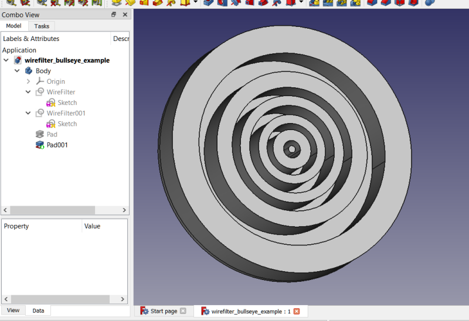

# WireFilter
With this FreeCAD macro you can filter a sketch (or any object with wires, including solids) to use only the wires you desire to use.  The sketch itself is unchanged.  The filter acts as an intermediary.  You can also 2D offset the wires, reorder the wires, scale the wires (independently in x, y, z directions), choose among 4 different face makers, and form a new wire from selected edges.  When used in Part Design it automatically inserts itself into the parent body of the selected sketch.  With WireFilter you can use Pad on sketches it would otherwise not be able to use (if it has nested wires within nested wires, for example if you make a face using the FaceMakerBullseye option). 
 
 
 
<a href="wirefilter_bullseye_example.FCStd">Download</a> the example file. 
 
## Installation
WireFilter is not yet available in the addon manager.  To install, place the wirefilter.FCMacro file into your macro folder and run it.  On first run it asks to create a wirefilter.py file.  When wirefilter is updated it will also automatically update this .py file, but when you uninstall the WireFilter macro you need to delete the .py, too.
## Toolbar Icon
<a href="wirefilter.svg">Download</a> the toolbar icon: 

## Usage
Select an object to filter.  If the entire object is selected in the tree, then all the wires are used.  If one or more faces are selected, then the wires that make up those faces are used.  If one or more edges are selected, then the wires that contain those edges will be filtered for use.  After making the desired selection run the macro, and a new document object called WireFilter will be created.  Modify the WireFilter by editing its properties.  If desired, you can select edges of the WireFilter object in the 3D view and toggle the SelectEdges boolean trigger to put the selected edges into the Selected Edges property (a string list).  Then if you set UseSelectedEdges to True you will futher filter out all other edges and form a new wire from the selected edges.  This new wire can be offset, scaled, and made into a face.

By default it locates itself coincident with the filtered object, but if you wish to do so you can toggle the Follow Source property to False, and then attach the WireFilter or adjust its placement as desired.  In this manner you can have multiple WireFilters of the same sketch and place them in different positions, for example, to loft between them.

## Properties
A WireFilter object is a feature python object, fully parametric, with properties you may edit to change the object's behavior and in some cases to trigger commands.
### Offsetting
WireFilter's support 2D offsetting.  This is substantially the same tool used for Part workbench 2D offsetting, except we access via python here.  You have many of the same options.
#### Offset (float)
Default: 0.0.  The offset value (in mm).  A negative value will offset inwards.
#### Offset Fill (boolean)
Default: False.  If True, a face is made between the offset and the original wire.
#### Offset Intersection (boolean)
Default: False.  This manages how child shapes are handled, whether collectively (default) or independently.
#### Offset Join (enumeration)
Default: Arcs.  Options: Arcs, Tangent, Intersection.  The join type affects in some cases whether you get fillets or sharp angles where the new edges are joined.
#### Offset Open Result (boolean)
Default: False.  Whether to allow an open wire in the results.  If False open wires are closed.  For example, a straight line will be offset by encircling it with a slot-like wire with arcs at each end.
### Scaling
We can scale independently along all 3 major axes, x, y, and z.  -1 will mirror along that axis.
#### Scale (vector)
Default: (1,1,1).  The scale to use for the x, y, and z directions.  (Code borrowed / liberated / stolen from Draft Clone code.
### Selected Edges
After the initial filtering of the wires from the original object, we can then filter edges to use in the WireFilter object itself.  A wire is created from the selected edges and that is the only wire displayed.  A face can be made from the wire.  It can also be offset and scaled.  Usage: select the edges in the 3D view, then toggle the Select Edges trigger from False to True to populate the Selected Edges property (a string list holding the names of the selected edges).  Then set Use Selected Edges to True to enable this feature.
#### Select Edges (boolean trigger)
Default: False.  Not your typical boolean variable.  This is a command trigger.  When you set it to True it runs a command, then sets itself back to False for the next time.  This command will take the edges of the WireFilter object that are selected in the 3D view and use them to populate the Selected Edges property.
#### Selected Edges (stringlist)
Default: empty list.  Will hold the names of the selected edges to be used to make a wire.  This can be manually edited by entering in the names of the edges, e.g. Edge3, to use.
#### Use Selected Edges (boolean)
Default: False.  If True and if Selected Edges property is not empty, the selected edges are used in place of the wires currently in use.  A wire is made from the selected edges and displayed in the 3D view as the shape of the WireFilter object.  You can make a face of this wire, offset this wire, and scale this wire.
### Wire Filter
#### Claim Children (boolean)
Default: True.  Whether to claim children in the tree view.  You may toggle this to see the effect.
#### Face Maker (enumeration)
Default: No Face.  Options: No Face, Part::FaceMakerBullseye, Part::FaceMakerCheese, Part::FaceMakerSimple, Part::FaceMakerExtrusion.  Each has its strengths and limitations.  Sometimes when one fails another might work.  Bullseye is good at handling holes inside of holes in faces.  None of the others can do this.  Cheese is good as multiple holes, but not nested holes.  Simple and Extrusion fail with holes, but can manage some nonplanar wires where Bullseye and Cheese fail.
#### Fix Normal (boolean trigger)
Triggers a command, sets itself back to False.  The command is to attempt to fix a Pad or Extrude that has failed to determine the correct normal for a WireFilter pad or extrusion.  The WireFilter object computes its own normal.  (See Normal property.)  This Normal is used as a custom direction in the Pad or Extrude object.  If this doesn't work, try making a face and doing it again.
#### Follow Source (boolean)
Default: True.  If True, the WireFilter object's shape is at the same placement as the original object.  If the source object moves, the WireFilter moves with it.  Set this to False if you want to be able to place the WireFilter in another placement.  The WireFilter itself can be attached.
#### Normal (vector)
The normal direction for Wire1 / Face1 of the WireFilter object.  Normal means perpendicular to the plane of the wire / face.  If you imagine the surface of a tabletop, the normal direction would be straight up to the ceiling overhead.  If you're standing in front of your refrigerator, the normal of the front face of the refrigerator is coming towards your position.
#### Source (sublink)
The Source is the object from which the wires are being filter, example -- Sketch.  Optionally, this can also include individual faces or edges.  Select the face of a cube and run the macro.  The WireFilter will use the wire from which that face was made and exclude all the other wires in that cube.  If edges are selected, then all wires associated with those edges are used.  In a cube each edge is associated with 2 wires.  For example, if you select the top front edge then you get the top face wire and front face wire. Try it!  This can be done most easily when first making the WireFilter, but you can also edit this property after creation.  This is a very powerful feature becaus with it you can very easily pre-select certain wires to use in the WireFilter.
#### Version (string)
The version of the WireFilter macro used in creating this WireFilter object, not necessarily the same as installed currently.
### Wire Order
WireFilter can modify the order of the wires used.  This can be useful where in a loft the wires are crossed.  You can change the wire order rather than edit one of the sketches.  Using 0 for a wire means don't use that wire at all, so this is a good way to filter out some wires, by setting their wire order to 0.
#### Use Default (boolean trigger)
Default: False.  Sets itself back to False and resets the Wire Order to [1,2,3,4...], the default order.
#### Use Selected (boolean)
Default True:  If True, then the wire names, face names, or edge names in the Source property are used, regardless of the Wire Order setting.  Toggle this to False if you want to use the Wire Order property for filtering the wires.  (While True, the Wire Order property is readonly.)
#### Wire Order (integer list)
The order of the wires.  Normally, wire order doesn't really matter, but sometimes it does. If lofting between 2 sketches with more than 1 wire each, then the wires are connected to each other by their wire orders.  Wire1 from sketch1 to Wire1 from sketch2, and so on.  The wire order, by default, is the order in which the wires were created when making the sketch.  So, if you are making sketches to be lofted, be sure to create the wires in the same order in both sketches.  Otherwise, you might need to either edit the sketches or use this wire order to get the correct wires connected to each other. 
 
Another usage for this property is to enable/disable certain wires.  Setting a wire's order to 0 means don't use the wire at all.  You can delete later wires and the WireFilter will pad the 0's for you in the missing spots automatically.  For example, if you have 8 wires: 1,2,3,4,5,6,7,8 and you only want to use 1 and 2 you can delete 3 through 8 and the WireFilter object will make the wire order 1,2,0,0,0,0,0,0 for you.  Note: the line number is the wire and the value is the wire order for that wire.

## Known Issues:

It is known that sometimes Pad, Extrude, and Pocket cannot find the proper normal for the WireFilter.  If it's a Pad or an Extrude you can use FixNormal to try to fix the Pad or Extrude by setting its custom direction to the wires true normal.  For Pockets, there currently is no option for using custom directions.  You can try creating a Draft facebinder of the WireFilter and using that for the Pocket's profile. Sometimes this works, but sometimes not.  I am hopeful that at some point in the 0.20 development cycle Pocket's will get this Custom direction property and I'll be able to use it to fix problematic Pockets, too.

## Changelog
##### 0.2021.10.20.rev2
Check wire is closed before trying to find normal.
##### 0.2021.10.19.rev2
Add option to fix normals on Pads and Extrudes that cannot find the normal properly
##### 0.2021.10.19
Initial upload
